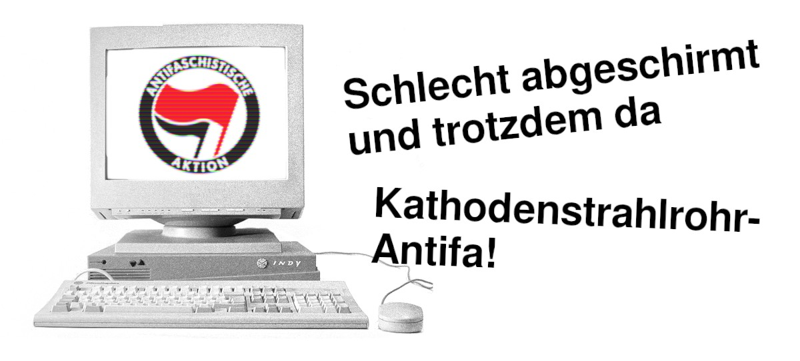

Behörden können deine elektronischen Geräte beschlagnahmen, auslesen, Deine Konten übernehmen, deine Kommunikation und Anschlüsse überwachen. Das passiert gar nicht so selten. 

**Sei für diesen Fall vorbereitet!**

Mit ein paar Vorsichtsmaßnahmen kannst du dafür sorgen, dass die ganze Aktion zwar nervig ist, aber der Staat [nicht in deinen persönlichen Daten rumschnüffelt](https://www.kontextwochenzeitung.de/debatte/438/linksunten-6138.html). 
Hier bekommst du einige Anhaltspunkte wie du dich schützen kannst, auch ohne ein Computernerd zu sein. Lieber jetzt ein wenig Arbeit investieren und dafür bleiben später deine Daten für die Cops tabu.

Der Quelltext von ACAB ist unter [https://github.com/beschlagnahmt-org/beschlagnahmt](https://github.com/beschlagnahmt-org/beschlagnahmt) zu finden. 
Wenn du einen Fehler gefunden oder einen Verbessungsvorschlag hast, [lass es uns wissen](https://github.com/beschlagnahmt-org/beschlagnahmt/issues).
Gerne kannst du direkt [auf Github einen Verbesserungsvorschlag einreichen](https://github.com/beschlagnahmt-org/beschlagnahmt/pulls).
Sollte dir das zu öffentlich sein, melde dich gerne per Mail.

  
(Computer: CC-BY-SA-3.0 Thomas Kaiser, Montage: Beschlagnahmt)
