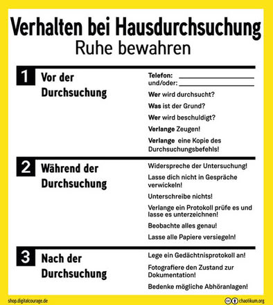

Guten Morgen Sonnenschein! Es ist [6 Uhr](https://www.ferner-alsdorf.de/hausdurchsuchung-zeiten/) morgens und einige unfreundliche Beamt:innen stehen vor deiner Wohnung und erklären dir, dass sie nun eine Durchsuchung durchführen werden.
Du bleibst natürlich cool und rufst dir in Erinnerung wie du dich [in so einer Situation verhalten solltest](https://rote-hilfe.de/sites/default/files/2023-10/wtwb_sep2022.pdf).

Dieser Aufkleber an deiner Türe hilft Dir in der Hektik nichts Wichtiges zu vergessen:  
  
[Bestellen](https://shop.digitalcourage.de/digitalcourage-und-ccc-aufkleber/hausdurchsuchung-was-tun.html) - [Herunterladen](https://shop.digitalcourage.de/files/HausdurchsuchungChaotikum.pdf)

Noch __bevor__ du die Türe öffnest, schaltest du deine Geräte aus:

  - Bei deinem PC/Laptop hältst Du den Power-Knopf ca. 5–10 Sekunden lang gedrückt.
  - Android: Ein/Aus-Taste (+ ggf. Lauter-Taste) gedrückt halten, dann auf „Ausschalten“ tippen.
  - iOS: Entsperren, Seitentaste (rechts) und eine Lautstärketaste (links) gleichzeitig gedrückt halten, dann Schieberegler „Ausschalten“ nach rechts ziehen.
  - Da dies je nach Modell unterschiedlich sein kann, probiere es direkt jetzt mal aus.

Falls du telefonieren musst, nimm ein anderes Gerät z.B. das deiner 'Gäste'.
Zum Glück klebt an deiner Türe der hilfreiche Aufkleber mit der Telefon-Nummer deiner Verteidiger:in.

Warum du das machen solltest erfährt du beim Thema "[Auswertung von Geräten](/auswertung-von-geraeten/)".

Irgendwann werden sie dann anfangen deinen Kram einzupacken.
Achte darauf, dass sie sich an den Durchsuchungsbeschluss halten und sei ansonsten ganz entspannt.
Du bist nicht verpflichtet Passwörter oder PINs heraus zu geben, [mache das auch nicht](https://www.youtube.com/watch?v=bpPv1WEi6ZY).
Auch musst du nicht freiwillig deinen Finger auf den Sensor legen oder das Gerät mit deinem Gesicht entsperren, die Cops [dürfen dich allerdings dazu zwingen](https://www.tagesschau.de/inland/gesellschaft/smartphone-sperre-fingerabdruck-100.html).

Falls möglich lasse deine elektronischen Geräte vor Ort versiegeln, vielleicht schafft es deine Anwält:in die Auswertung im Nachgang noch zu verhindern.

Achte darauf, dass alles, was mitgenommen wird, detailliert im Sicherstellungsprotokoll aufgelistet wird.
Unterschreibe das Protokoll nicht, lasse es aber von den Durchsuchenden unterzeichnen.
