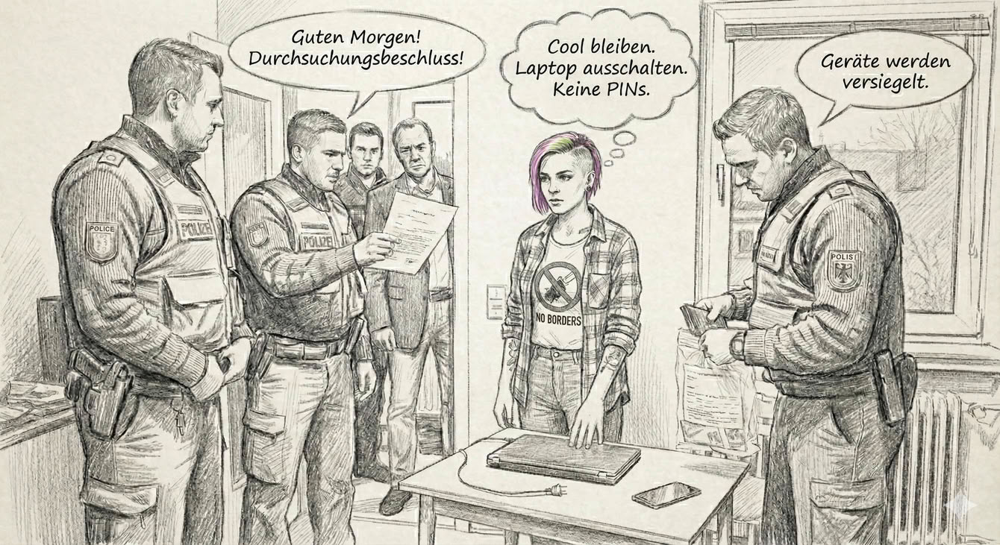

Guten Morgen Sonnenschein! Es ist [6 Uhr](https://www.ferner-alsdorf.de/hausdurchsuchung-zeiten/) morgens und einige unfreundliche Beamt:innen stehen vor deiner Wohnung und erklären dir, dass sie nun eine Durchsuchung durchführen werden.
Du bleibst natürlich cool und rufst dir in Erinnerung wie du dich [in so einer Situation verhalten solltest](https://rote-hilfe.de/downloads1/category/3-was-tun-wenn-s-brennt-und-rechtshilfe-infoflyer-zu-spezifischen-themen?download=10:infoflyer-hausdurchsuchung-was-tun).

Deine Computer fährst du herunter bevor Du die Türe öffnest, falls du keine Zeit hast, hälst Du den Power-Knopf ein paar Sekunden lang gedrückt.
Bei Geräten ohne Akku kannst Du auch den Stecker ziehen. Dank Verschlüsselung und von dir clever gewählten Passwörtern sind die Daten damit nach wenigen Sekunden sicher.

> Warum: Moderne Verschlüsselung (wie BitLocker, FileVault, LUKS) ist nur dann wirklich sicher, wenn das Gerät ausgeschaltet ist. Solange der Computer läuft, liegen die Entschlüsselungs-Keys oft im Arbeitsspeicher (RAM), wo Spezialisten sie unter Umständen auslesen können (Stichwort: Cold Boot Attack). Strom weg = RAM leer = Daten sicher.

Aus dem gleichen Grund schaltest du auch dein Handy aus.
Falls du telefonieren musst, nimm ein anderes Gerät z.B. das deiner 'Gäste'.

> Warum: Im ausgeschalteten Zustand greift die "Boot-Verschlüsselung" (Secure Startup). Außerdem können biometrische Merkmale (Fingerabdruck, FaceID) im ausgeschalteten Zustand nicht zur Entsperrung genutzt werden – es werden zwingend PIN bzw. Passwort benötigt.

Irgendwann werden sie dann anfangen deinen Kram einzupacken.
Achte darauf, dass sie sich an den Durchsuchungbeschluss halten und sei ansonsten ganz entspannt.
Du bist nicht verpflichtet Passwörter oder PINs heraus zu geben, [mache das auch nicht](https://www.youtube.com/watch?v=bpPv1WEi6ZY). Du musst auch nicht deinen Finger auf den Sensor legen oder das Gerät mit Deinem Gesicht entsperren.

Falls möglich lasse deine elektronischen Geräte vor Ort versiegeln. Das erschwert nachträgliche Manipulationen an der Hardware.

Achte darauf, dass alles, was mitgenommen wird, detailliert im Sicherstellungsprotokoll aufgelistet wird. Unterschreibe das Protokoll nur, wenn es korrekt ist. Du musst aber nichts unterschreiben, womit du nicht einverstanden bist.

