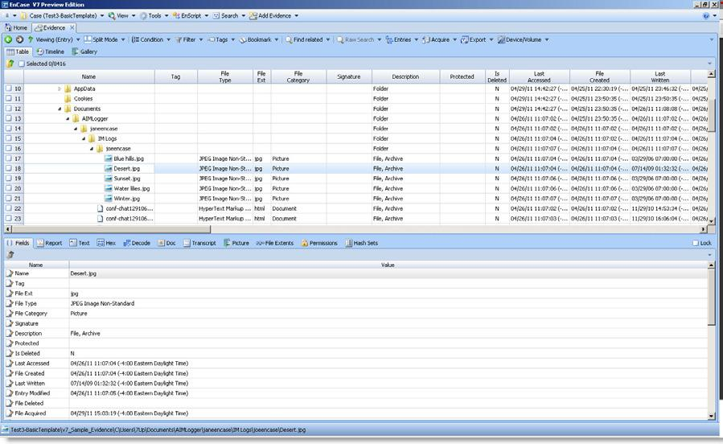
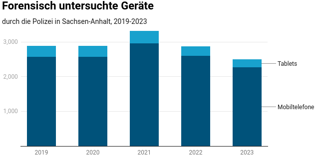

Falls euer Gerät beschlagnahmt wurde, werden die Cops oder ein:e Sachverständige:r versuchen deine Daten auszulesen und gerichtsverwertbar zu machen. 
Wenn du deinen Kram anständig geschützt hattest, werden sie dabei hoffentlich nicht weit kommen.
Andernfalls werden die Daten akribisch durchsucht. 
Den dabei verwendeten Forensikprogrammen entgeht kaum etwas und manchmal können selbst gelöschte Daten wiederhergestellt werden.

Wird das Verfahren irgendwann eingestellt bekommst du deine beschlagnahmten Sachen zurück. Das dauert aber oft einige Monate bis hin zu Jahren.

## Wann ist dein Gerät auslesbar?

Grundsätzlich entscheidet man beim Schutz von ungewolltem Auslesen oder Entsperren zwei Zustände:

  1. **Before First Unlock (BFU)**  
  Das Gerät wurde nach dem Starten *nie* mittels Passwort / PIN entsperrt.
  Es greift die volle Geräte-Verschlüsselung.
  Deshalb können auch keine biometrische Merkmale (Fingerabdruck, FaceID) zur Entsperrung genutzt werden – es werden zwingend PIN bzw. Passwort benötigt.
  
  2. **After First Unlock (AFU)**  
  Das Gerät ist aktuell gesperrt, wurde aber nach dem Starten bereits mittels Passwort / PIN entsperrt.
  Hier liegen Passwörter oder PIN bereits im Speicher des Geräts.
  
Das heißt für die häufigsten Geräte bzw. Betriebssysteme:

### Android & Apple-Geräte

Bei Android & Apple-Geräten ist die Situation nicht eindeutig. Hier liefern sich die Hersteller der Geräte ein permanentes Wettrennen mit Firmen wie Cellebrite um das Finden und [Ausnutzen von hilfreichen Sicherheitslücken](https://www.amnesty.ch/de/laender/europa-zentralasien/serbien/dok/2024/behoerden-setzen-spyware-gegen-journalist-innen-und-aktivist-innen-ein) bzw. deren Schließung. Wer gerade bei welchen Modellen die Nase vorne hat erfährt man nur, wenn mal wieder [Informationen dazu leaken](https://osservatorionessuno.org/blog/2025/03/a-deep-dive-into-cellebrite-android-support-as-of-february-2025/).

| **BFU** | Modellabhängig, meißt auslesbar |
| **AFU** | Modellabhängig, meißt auslesbar |
| **Verteidigung** | &bull; BFU: Lange Passphrase, siehe [Passwörter](/passwort/)  &bull; Ungenutzte Geräte ausschalten  &bull; Auf (Gerät mit) GrapheneOS wechseln, siehe [Betriebssysteme](/smartphone-betriebssysteme/)   &bull; Möglichst aktuelle Geräte-Generation verwenden &rarr; i.d.R. bessere Sicherheitschips|

**Schlussfolgerung:** Die Cops bekommen dein Handy meißtens entsperrt oder ausgelesen. Du solltest deshalb möglich wenig interessantes Material auf deinen Geräten haben, z.B. in dem du [verschwindende Nachrichten](/messenger/) verwendest.

### Linux

| **BFU** | Geschützt, wenn Verschlüsselung aktiv (Standard) | 
| **AFU** | Auslesbar | 
| **Verteidigung** | &bull; Ungenutzte Geräte herunter fahren  &bull; BFU: Lange Passphrase, siehe [Passwörter](/passwort/)  &bull; [Tails](/anonym-im-netz/#tails) nutzen &rarr; Speichert keine Daten auf dem Gerät | 

### Windows

| **BFU** | Auslesbar |
| **AFU** | Auslesbar | 
| **Verteidigung** | &bull; Auf Linux wechseln   &bull; BFU: VeraCrypt, siehe [Daten verschlüsseln](/daten-verschluesseln/)  &bull; [Tails](/anonym-im-netz/#tails) nutzen &rarr; Speichert keine Daten auf dem Gerät |

## Statistik

Leider werden die entsprechenden Zahlen nicht systematisch erfasst.
Es gibt jedoch Statistiken aus einzelnen Bundesländer, hier z.B. Sachsen-Anhalt:

  
Quelle: [netzpolitik.org](https://netzpolitik.org/2024/sachsen-anhalt-alle-35-stunden-durchsucht-die-polizei-ein-smartphone/#2024-02-07_ZahlenSAH)
