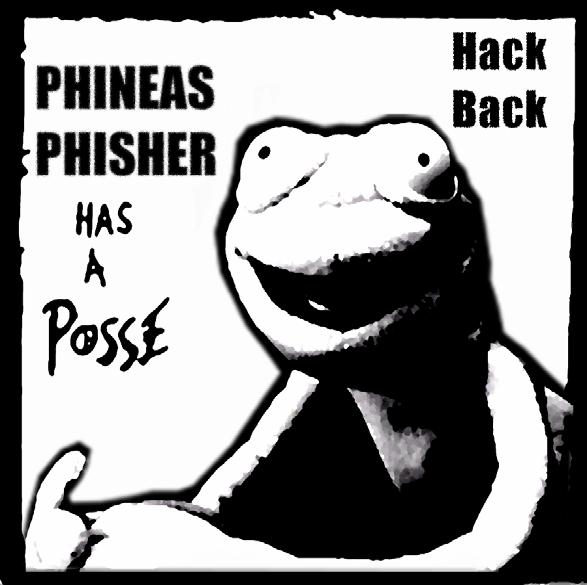

Eine “Online-Durchsuchung” lässt sich weniger mit einer Hausdurchsuchung vergleichen und eher mit einem Lauschangriff. Die Behörden versuchen dabei einen Trojaner auf dem Zielsystem zu installieren und so Daten und Kommunikation abzugreifen. Der Rahmen der Spionage ist dabei nicht ganz klar. So hat zum Beispiel die Firma DigiTask, der Hersteller des “Staatstrojaners”, Funktionen in die Software eingebaut die die Behörden überhaupt nicht nutzen dürften. Auch die Software FinFisher der deutschen Firma Gamma Group wurde zeitweise ohne Rechtsgrundlage vom LKA Berlin lizenziert. Dadurch diese Überwachungsmethode Verschlüsselung umgangen werden kann ist es wichtig, dass du darauf achtest das deine Systeme sauber bleiben. Hinweise dazu findest du im Kapitel “Systemsicherheit“. Nette Geschichte am Rande: Die Firmen Gamma und Hacking Team wurden beide von einem Frosch namens Phineas Phisher gehackt und interne Daten über ihre Geschäfte ins Netz gestellt.

Links:

- [Überwachung durch Staatstrojaner](https://youtu.be/8REBKuFGfk8) 
- [Chaos Computer Club analysiert Staatstrojaner](https://www.ccc.de/de/updates/2011/staatstrojaner)

