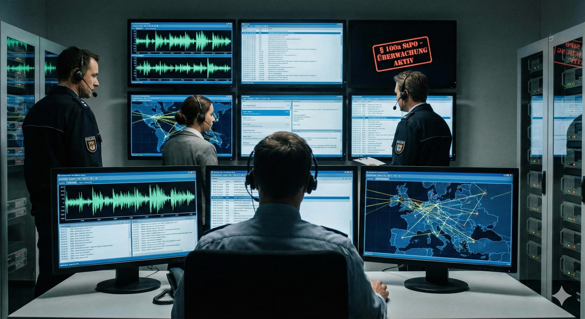

# Kommunikationsüberwachung
Bei der Telekommunikationsüberwachung, oder kurz TKÜ hören die Behörden Kommunikation direkt beim Dienstbetreiber ab.
Das kann zum Beispiel euer Handyanbieter sein, euer Internet-Provider oder euer E-Mail Service.
Bei Telefonaten kann bereits ab dem Zeitpunkt des Verbindungsaufbau mitgehört werden. Wenn du noch das piepen hörst, weil die angerufene Person das Gespräch bisher nicht angenommen hat und dich dabei mit jemanden neben dir unterhältst - wird das protokolliert, der Inhalt analysiert und auch mit den Geodaten abgeglichen, die den Schnüfflern bekannt sind.
Es können viele Daten auch im Nachhinein angefordert werden, zum Beispiel die Websites die du aufgerufen hast, die Nummern die du angerufen hast, die E-Mails die du geschrieben hast und die Privatnachrichten die du auf Facebook verschickt hast.
(Vorrausgesetzt der Anbieter hat diese Daten noch gespeichert.)
Auch hier kannst du dich wieder durch verschiedene Verschlüsselungsverfahren schützen.

Um das Thema Vorratsdatenspeicherung wird aktuell noch gestritten.
Momentan ist diese ausgesetzt, wie sich das in Zukunft entwickeln wird ist aber noch unklar.
Halte dich am besten gelegentlich etwas auf dem Laufenden.

Neben solchen Anfragen bei Dritten gibt es auch noch den sogenannten “Großen Lauschangriff” also das direkte Abhören der Wohnung mit Mikrofonen.
Dieser wird aber recht selten angewandt.
Im Jahr 2019 wurden im repressiven Bereich 9 Maßnahmen angeordnet und 7 davon vollzogen.
Beachte das eine Hausdurchsuchung für die Cops eine gute Gelegenheit ist Wanzen zu deponieren.

Wer ebenfalls gelegentlich mithört sind die Sprachassistenten von Google, Apple und Amazon. Diese Geräte nehmen kontinuierlich ihre Umgebung auf.
(Sonst könnten sie ja auch gar nicht auf ein “Hey Google” reagieren.)
Aufzeichnungen von Sprachbefehlen werden auf den Servern der Anbieter gespeichert und können theoretisch auch von den Behörden angefragt werden.

Mensch sollte es sich auf jeden Fall zweimal überlegen welche Gespräche in der Gegenwart von Alexa oder einem Handy mit aktivierter Google-Sprachsteuerung geführt werden sollten.

## Statistik
Wie oft werden eigentlich Überwachungsmaßnahmen angeordnet?
Beispielhaft schauen wir uns hier mal die Statistiken von 2015 und 2017 an, welche von netzpolitik.org aufbereitet wurden.
Im Jahr 2015 gab es 3332 Festnetz-Überwachungen, 21906 Mobilfunküberwachungen und 7431 Internetüberwachungen. Verkehrsdatenüberwachungen, also das Sammeln von Metadaten über die Kommunikation wurde in ganzen 26265 Fällen angeordnet und die Anordnung in weiteren 899 Fällen verlängert.
Im Jahr 2017 sind diese Zahlen leicht abgesunken, aber im Vergleich noch immer ausgesprochen hoch.

Bild: Creative Commons BY-NC-SA 4.0. Netzpolitik.org

Links:

- [Wikipedia - Vorratsdatenspeicherung](https://de.wikipedia.org/wiki/Vorratsdatenspeicherung)
- [Polizei überwacht vor allem wegen Drogen](https://netzpolitik.org/2016/statistik-polizei-ueberwacht-weiterhin-vor-allem-wegen-drogen/)
- [Polizei überwacht erstmals weniger](https://netzpolitik.org/2019/ueberraschung-polizei-ueberwacht-erstmals-weniger-kommunikation/)
