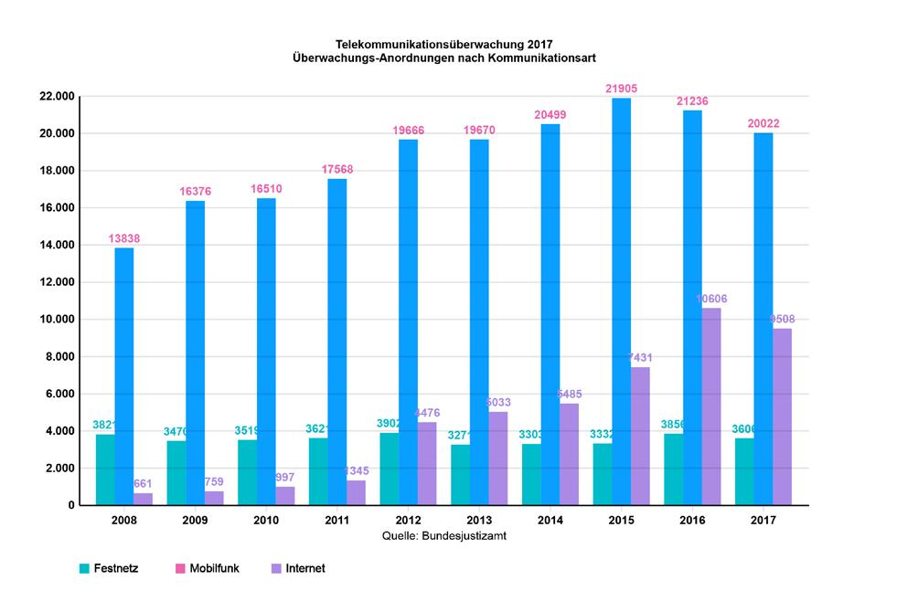

Bei der Telekommunikationsüberwachung (TKÜ) werden Betreibende von Diensten gezwungen all eure Aktivitäten den Behörden zur Verfügung zu stellen.

 

### Handyanbieter
Kommunikationsparten:innen, Standort des mit Gerät verbundenen Funkmasts, Zeitpunkt und Dauer deiner Kommunikation, alle übertragene Daten, Inhalt der Telefongespräche (ab dem Zeitpunkt des Verbindungsaufbaus) und SMS.  
   *Verteidigung*: Gegen das speichern des Standorts hilft nur das deaktivieren der Mobilfunkverbindung, gegen viele anderen Angriffe siehe [Telefonie](/telefonie/) und [Messenger](/messenger/)
   
### Internet-Provider
Alle über den Anschluss (Festnetz oder Handy) übertragene Daten, inkl. von dir aufgerufene    Seiten bzw. genutzen Dienste.  
   *Verteidigung*: Siehe [Anonym im Netz](/anonym-im-netz/)

### E-Mail Dienst
Inhalt und Kommunikationspartner:innen von eingehenden und ausgehenden Mails, sowie die IP-Adresse des Anschlusses von dem zugegriffen wurde.  
   *Verteidigung*: Schutz des Inhalts, nicht der Metadaten (Kommunikationspartner:innen) siehe [Mail-Verschlüsselung](/mail-verschluesselung/); deine IP-Adresse kannst Du wie unter [Anonym im Netz](/anonym-im-netz/) beschrieben verbergen.

### Social Media
Deine DMs und sonstigen Inhalte, sowie die IP-Adresse des Anschlusses von dem zugegriffen wurde.  
   *Verteidigung*: Nutze die DMs in Social Media außschließlich für den Verweis auf einen sicheren [Messenger](/messenger/); deine IP-Adresse kannst Du wie unter [Anonym im Netz](/anonym-im-netz/) beschrieben verbergen.

## Statistik
Wie oft werden eigentlich Überwachungsmaßnahmen angeordnet?
Laut [Bundesamt für Justiz](https://www.bundesjustizamt.de/DE/ServiceGSB/Presse/Pressemitteilungen/2025/20250805.html) gab es 2023 15.939 Anordnungen zur Telekommunikationsüberwachung.