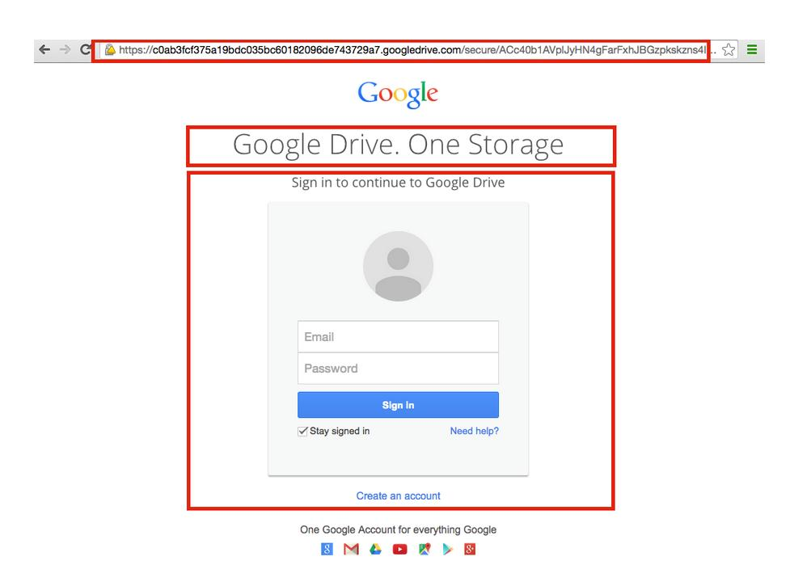

# Phishing
Es klingt wie der billigste Trick der Welt, ist aber eine sehr verbreitete Methode um an fremde Zugangsdaten zu gelangen.
Beim Phishing wird eine Seite perfekt nachgebildet und die Zielperson dazu gebracht sich auf der gefälschten Seite einzuloggen.
Die Angreifer:innen können die Zugangsdaten dann lesen und sich auf der richtigen Seite einloggen. Die Nachbildungen können extrem realistisch sein, mit ein paar Tricks ist es sogar möglich, dass die Adresse genau gleich aussieht, zum Beispiel in dem Buchstaben aus dem kyrillischen Alphabet eingesetzt werden, die wie lateinische Buchstaben aussehen.
Um sicher zu gehen bedenke immer, ob dich die Seite auf einem vertrauenswürdigen Weg erreicht hat oder ob dir irgendwer unter einem Vorwand einen Link geschickt hat, der dich zu dieser Login-Maske geführt hat.
Am sichersten ist es wenn du Adressen immer selbst eintippst oder die Lesezeichenfunktion deines Browsers verwendest.

So könnte eine Phishing Seite aussehen. Beachte die Auffälligkeiten die hier mit Kästen markiert sind.
