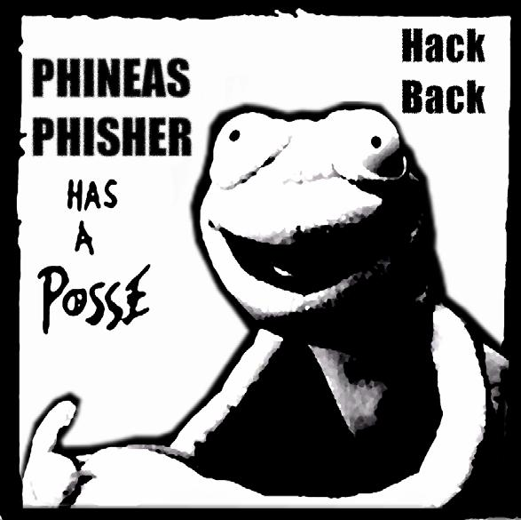

# Online Durchsuchung und Quellen TKÜ
{:.no_toc}

  

    Inhalt
  

* TOC
{:toc}

## Online-Durchsuchung

Eine 'Online-Durchsuchung' lässt sich mit einer heimlichen Hausdurchsuchung vergleichen. Die Behörden versuchen dabei einen Trojaner auf dem Zielsystem zu installieren und so alle gespeicherten Daten (Fotos, Adressbuch, Kalender, Chats, ...) abzugreifen. So hat zum Beispiel die Firma DigiTask, der Hersteller des “Staatstrojaners”, Funktionen in die Software eingebaut die die Behörden überhaupt nicht nutzen dürften. Auch die Software FinFisher der deutschen Firma Gamma Group wurde zeitweise ohne Rechtsgrundlage vom LKA Berlin lizenziert.

## Quellen-TKÜ

Die harmlos klingende Bezeichnung 'Quellen-TKÜ' ist in der Praxis nichts anderes als eine 'Online-Durchsuchung light'. Auch hier wird eine Schadsoftware auf euer(e) System(e) aufgebracht, mit dem Unterschied, dass nur 'laufende Kommuniaktion' abgeört werden soll. Durch die starke Zunahme von Messengern mit Ende-zu-Ende-Verschlüsselung ist die Quellen-TKÜ ein immer beliebteres Mittel der Behörden. Es ist jedoch relativ aufwändig und teuer, so dass es nicht annähernd so oft eingesetzt wird wie das 'klassische' Abhören von Telefonaten und SMS.

## Gegenmaßnahmen

Um dir gar nicht erst so einen Staatstrojaner ein zu fangen ist es wichtig, dass du darauf achtest das deine Systeme sauber bleiben. Hinweise dazu findest du im Kapitel “[Systemsicherheit](/systemsicherheit/)“. Gegen eine dauerhafte Infektion schützt dich auch die Verwendung des im Kapitel "[Anonym im Netz](/anonym-im-netz/)" beschriebenen Betriebssystems 'Tails'.

Nette Geschichte am Rande: Die Firmen Gamma und Hacking Team wurden beide von einem Frosch namens Phineas Phisher gehackt und interne Daten über ihre Geschäfte ins Netz gestellt.

Links:

 * [Überwachung durch Staatstrojaner](https://youtu.be/8REBKuFGfk8)
 * [Chaos Computer Club analysiert Staatstrojaner](https://www.ccc.de/de/updates/2011/staatstrojaner)

