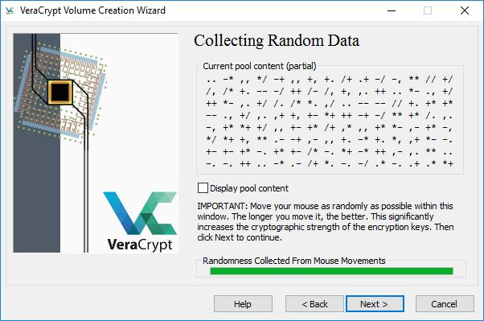
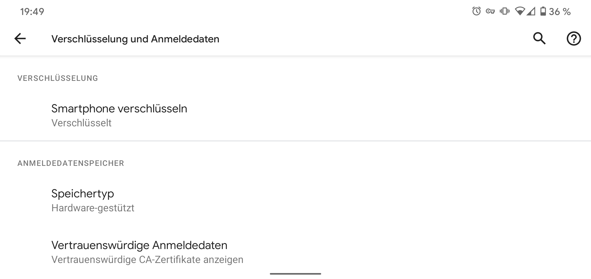

# Daten verschlüsseln
{:.no_toc} 

  

    Inhalt
  

* TOC
{:toc}

So schützt du also die Daten die du eh nicht mehr haben willst.
Aber was ist mit denen die du noch brauchst?
Diese solltest du verschlüsseln.
Wenn du das richtig machst haben die Behörden kaum eine Chance an die Daten heranzukommen.

## Grundsätzliches
Ein Versteck ersetzt keine Verschlüsselung. Irgendwo tief in einem Ordner abgelegte Dateien werden die Behörden mit großer Sicherheit finden.
Gleiches gilt für in der Wohnung versteckte Datenträger, denn auch der Einsatz von Datenspeicher-Spürhunden hat zugenommen.
Effektiv schützen kannst du dich nur in dem du deine Daten verschlüsselst.
Wenn sie Datenträger mitnehmen ist das egal, da sie dich nicht zwingen können das Passwort herauszugeben.
In den gleich folgenden Anleitungen wirst du dir an einigen Stellen ein Passwort ausdenken müssen.
Bitte beachte hierfür auch das Kapitel “Passwort”. Ein gutes Passwort ist für die Sicherheit deiner Daten essentiell.
Wenn du Backups von deinen Daten anlegst, denk daran auch diese zu verschlüsseln.
Bevor du versuchst deine Geräte zu verschlüsseln lege auch eine Sicherung an, falls dabei was schiefgeht.
Und noch was: Am sichersten sind die Daten die du gar nicht erst speicherst.
Halte dich besonders bei heiklen Informationen an das Konzept der Datensparsamkeit.
Wenn du unbedingt Papiere aufbewahren musst tue dies in einem Umschlag der mit “Für meinen Anwalt” o. Ä. beschriftet ist.

> ⚠ Bedenke das diese Verfahren umgangen werden können indem in deine Wohnung eingedrungen wird und ein Keylogger installiert wird. Das ist ein kleines Gerät am USB Anschluss oder eine Software welche die Tastatureingaben mitschneidet. Statte also dein UEFI und ggf. deinen Bootloader [mit einem Passwort aus](https://www.wikihow.com/Set-a-BIOS-Password) und prüfe immer mal wieder den Anschluss deiner Tastatur auf Unregelmäßigkeiten. ⚠

## Laptop / Desktop
Für deinen Computer hast du zwei grundlegende Optionen.
Du kannst das [gesamte System verschlüsseln](https://www.veracrypt.fr/en/System%20Encryption.html), oder einen verschlüsselten Container anlegen in dem du du vertrauliche Dateien ablegst.

### Systemverschlüsselung mit VeraCrypt (Windows)
1. [VeraCrypt](https://www.veracrypt.fr/) installieren und starten
2. “Create Volume” klicken
3. “Encrypt the system partition” anwählen und “Next”
klicken
4. “Normal” anwählen, “Next”
5. “Encrypt the whole drive”
6. Single- oder Multiboot auswählen. Wenn du nicht weißt worum es geht wähl einfach ersteres
7. Algorithmen auswählen (AES und SHA-256 sind in Ordnung)
8. Passwort eingeben (siehe dazu Kapitel „Passwort“)
9. Die Maus möglichst zufällig durch das Fenster bewegen bis der grüne Balken voll ist, dann “Next”
10. “Next”
11. Entsprechend der Anweisungen eine Rescue Disk erstellen. Wenn du kein CD-Laufwerk hast kannst du auch einen USB-Stick verwenden. Mit der CD bzw. dem USB-Stick kannst du das System nicht wiederherstellen wenn du dein Passwort vergessen hast. Sie dienen nur dazu das System zu retten falls Dateien beschädigt wurden die VeraCrypt zum entschlüsseln benötigt. Du solltest den Datenträger also gut aufbewahren, aber falls die Cops ihn kriegen sind deine Daten aber trotzdem noch sicher.

*VeraCrypt benötigt Zufallsdaten zum verschlüsseln.*

12. “1-Pass” Wipemode auswählen (Das kennen wir schon vom Löschen)
13. “Test” klicken. Der Rechner wird nun neustarten und du kannst dich das erste mal mit deinem Passwort anmelden. Wenn ein “PIM” verlangt wird drücke einfach Enter. Wenn alles funktioniert hat kann es weitergehen. 
14. VeraCrypt sollte sich automatisch gestartet haben. Auf den Button “Encrypt” klicken
15. Notfallanweisungen lesen, ggf. drucken und mit “Ok” bestätigen
16. Abwarten bis alles verschlüsselt ist.  

### Systemverschlüsselung bei der Installation (Linux)
Fast alle Linux-Betriebssysteme bringen bereits Verschlüsselungsmechanismen mit. Zwischen den Verschiedenen Linux-Distributionen gibt es einige Unterschiede. Meistens ist es am einfachsten die Verschlüsselung direkt bei der Installation zu aktivieren. Beispielhaft stehen hier die Schritte für Ubuntu, [hier](https://svenfila.wordpress.com/2010/11/04/encrypt-root-partition-without-re-installing-linux/) findest du aber auch Anleitungen für andere Distributionen und Möglichkeiten auch ohne Neuinstallation ein verschlüsseltes System zu bekommen.

1. Installationsprozess starten
2. Im Fenster “Art der Installation” einen Haken bei “Encrypt the new Ubuntu installation for security” setzen und weiter zum nächsten Schritt 
3. Passwort eingeben (siehe dazu Kapitel „Passwort“)
4. Haken bei “Overwrite empty disk space” setzen
5. Mit “Install Now” die eigentliche Installation starten.

### Systemverschlüsselung mittels Bitlocker (Windows)
Sollte dir das wirklich viel viel zu kompliziert sein kannst du auch schauen ob deine Windows Version “[Bitlocker](https://docs.microsoft.com/de-de/windows/security/information-protection/bitlocker/bitlocker-basic-deployment)” unterstützt.
Das ist das Verschlüsselungs-Programm von Microsoft.
Es ist einfacher zu bedienen, allerdings ist es sehr wahrscheinlich das dort Hintertüren eingebaut wurden.
Grundsätzlich kann VeraCrypt da deutlich mehr Vertrauen entgegen gebracht werden, aber bevor du stattdessen gar keine Verschlüsselung benutzt verwende lieber Bitlocker.

### Systemverschlüsselung mittels FileFault (MacOS)
1. Drücke die „Apple“-Taste > „Systemeinstellungen“ und klicke auf „Sicherheit“ und dann auf „FileVault“. (Wenn das Schloss unten links geschlossen ist , klicke auf das Schloss, um die Systemeinstellung zu entsperren.)
2. Klicke auf „FileVault aktivieren“. Du wirst daraufhin möglicherweise aufgefordert, dein Passwort einzugeben.
3. Nun kann du die eine Methode zum Aufheben des Schutzes auswählen, falls Du Dein Passwort vergessen hast. Klicke hier auf „Wiederherstellungsschlüssel erstellen und meinen iCloud-Account nicht verwenden“. Schreibe den Wiederherstellungsschlüssel auf und lege ihn an einem sicheren Ort ab.
4. Klicke auf „Fortfahren“. Wenn dein Mac weitere Benutzer hat, werden deren Informationen ebenfalls verschlüsselt. Die Benutzer entsperren die verschlüsselte Festplatte mit ihrem Anmeldepasswort.

### Container mit VeraCrypt (Windows und Linux)
Das war die Systemverschlüsselung. Alternativ kannst du auch einen Container erstellen und deine Daten darin ablegen, anstatt das ganze System zu verschlüsseln.
Dann musst du natürlich darauf achten keinerlei kritische Daten außerhalb des Containers zu belassen, was nicht immer ganz einfach ist.

1. VeraCrypt installieren und starten
2. “Create Volume” klicken
3. “Create an encrypted file container” anwählen und “Next” klicken
4. “Standard VeraCrypt volume”
5. Einen Speicherort und Dateinamen für deinen Container auswählen, den Haken bei “Never save history” belassen
6. Algorithmen auswählen (AES und SHA-256 sind in Ordnung)
7. Größe des Containers festlegen
8. Passwort eingeben (siehe dazu Kapitel „Passwort“)
9. Ein Dateisystem auswählen (FAT ist in Ordnung) und die Maus möglichst zufällig durch das Fenster bewegen bis der grüne Balken voll ist, dann “Format”
10. Abwarten bis die Erstellung abgeschlossen ist und mit “Exit” das Programm verlassen

#### Container mit VeraCrypt öffnen
1. VeraCrypt starten
2. Freien Laufwerksbuchstaben auswählen
3. “Select File” und die Containerdatei auswählen
4. “Mount”
5. Passwort eingeben und “Ok” klicken

## Smartphone
Die meisten Smartphones kommen heutzutage 'ab Werk' mit verschlüsseltem Speicher.
Ob die Speicherverschlüsslung wirklich akiv ist, solltest du zur Sicherheit trotzdem einmal überprüfen.
Das geht auf jedem Gerät ein wenig anders. Meist wirst du in den Einstellungen unter 'Sicherheit' fündig, den genauen Weg für dein Gerät recherchierst du am besten selber.
Sollte die Verschlüsselung nicht aktiviert sein, solltest Du das sofort nachholen. Du lädst deinen Smartphone auf und wählst die Option zum Verschlüsseln, gibst zweimal deine gewünschtes Passwort/PIN ein.
Wie Du ein möglichsts sicheres wählst, kannst du im Kapitel [Passwörter](/passwort/) nachlesen.
Nun wartest bis der Prozess abgeschlossen ist.
Teilweise muss nochmal explizit angewählt werden das auch die externe Speicherkarte verschlüsselt werden soll.
Grundsätzlich ist das alles auch genau so sicher wie auf dem Computer, aber besonders ältere Geräte, die nicht mehr mit Updates versorgt werden stellen ein zusätzliches Risiko dar.
Trotz Verschlüsselung ist es also vernünftig zu Aktionen nur ein billiges Zweit-Handy mitzunehmen, auf dem keine persönlichen Daten gespeichert sind.
Auch eine SIM-Karte, die nicht mit deinem Namen verknüpft ist, ist dabei eine gute Idee.

