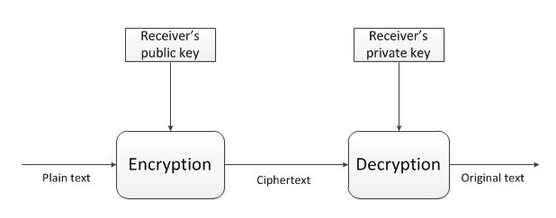

# Mail-Verschlüsselung
{:.no_toc}

  

    Inhalt
  

* TOC
{:toc}

## Grundsätzliches
Wenn du eine Mail über das Internet versendest wird sie viele Stellen durchlaufen bis sie am Ziel angekommen ist.
Vielen davon musst du, ohne Verschlüsselung einfach vertrauen, dass sie deine Daten schützen und sich im Zweifel auch gegen Behördenanfragen zur Wehr setzen.
Das machen aber leider viele nicht. Zum Beispiel ist bekannt das 1&1 zu denen auch GMX und Web.de gehören ohne große Rückfragen gespeicherte Daten weitergeben.
Aber auch bei kleineren Anbietern solltest du dich nicht darauf verlassen, dass die Betreiber:innen für dich in den Knast gehen werden wenn sie eine Anfrage bekommen.
Die Lösung ist auch hier wieder Verschlüsselung.

### Asymmetrische Verschlüsselung
Was wir gerade für die Verschlüsselung unserer Geräte verwendet haben war eine traditionelle symmetrische Verschlüsselung.
Das bedeutet das die Person an die Daten kommt die das Passwort hat.
Für Kommunikation ist das etwas unpraktisch, da so das Passwort zwischen allen Kommunikationsteilnehmer:innen auf einem sicheren Kanal ausgetauscht werden muss bevor kommuniziert werden kann.
Das ist umständlich und bringt das Risiko mit sich, dass das Passwort beim Austausch abgefangen wird.
Dieses Problem wird mit asymmetrischer Verschlüsselung gelöst.
Bei dieser haben unsere Kommunikationsteilnehmer:innen Alice und Bob je einen öffentlichen und einen privaten Schlüssel.
Der öffentliche Schlüssel wird nur zum verschlüsseln verwendet, der private Schlüssel wird nur zum entschlüsseln verwendet. 

> Alice und Bob?
>
> Alice und Bob sind die “Anna und Arthur” der Kryptografie, In unserem Beispiel wollen die beiden miteinander kommunizieren ohne dass Mallory mitlesen kann.

Ein privater und ein öffentlicher Schlüssel bilden ein Schlüsselpaar.
Eine Nachricht die mit Bobs öffentlichem Schlüssel verschlüsselt wurde kann nur mit seinem privatem Schlüssel entschlüssselt werden.
Selbst Alice die die Nachricht verschlüsselt hat kann die Verschlüsselung nicht rückgängig machen, denn nur Bob kennt den privaten Schlüssel.

Dieses Verfahren wird fast überall verwendet wo ohne einen sicheren Kanal zum Passwortaustausch kommuniziert werden muss.
Es ist auf den ersten Blick etwas kompliziert, funktioniert aber gut.

## Thunderbird für Windows, Linux und MacOS
**Thunderbird nutzt ab der Version 78 einen eigenen Schlüsselbund, eventuell müssen Schlüssel aus PGP exportiert und in Thunderbird importiert werden, falls du vorher Enigmail genutzt hast**
1. [Thunderbird](https://www.thunderbird.net/de/) installieren und mit deinem E-Mail-Konto verbinden
2. In den Konteneinstellungen unter "Ende-zu-Ende-Verschlüsselung" einen Schlüssel hinzufügen
3. Den Schlüssel in den Einstellungen auswählen
4. Schlüssel können über das Menü “Konten-Einstellungen -> Ende-zu-Ende-Verschlüsselung -> OpenPGP” importiert und exportiert werden.
5. Achte auch darauf, dass du die Schlüsselakzeptanz mindestens auf "Ja, aber ich habe nicht überprüft ob es sich im den korrekten Schlüssel handelt." gesetzt ist
6. An dich gerichtete verschlüsselte Nachrichten werden beim Empfang automatisch entschlüsselt
7. E-Mails die du schreibst sollten automatisch verschlüsselt werden, sofern du den entsprechenden öffentlichen Schlüssel importiert hast und dieser akzeptiert ist. Achte auf das Schloss-Symbol unten rechts.

## Thunderbird für Android

Für E-Mail Verschlüsselung unter Android kann an dieser Stelle die Kombination aus [Thunderbird für Android](https://www.thunderbird.net/de/mobile/) und [OpenKeychain](https://www.openkeychain.org/) wärmstens empfohlen werden.
THunderbird für Android unterstützt die Kopplung mit OpenKeychain, zu finden in den Accounteinstellungen unter dem Punkt "Ende-zu-Ende-Verschlüsselung".
Nun kann in den Mails die Verschlüsselung durch das Schloss am oberen rechten Bildschirmrand eingeschaltet werden, sollten die jeweiligen Schlüssel hinterlegt sein.
Dafür ist nichts weiter notwendig, als diese in der Openkeychain-App mittels Dateiimport, QR-Code oder Onlineschlüsselsuche hinzuzufügen.
Zum Entschlüsseln darf der eigene Privatekey an dieser Stelle natürlich nicht fehlen.

## PGP-Fingerprints
Während du Schlüssel erstellst oder importierst werden dir immer wieder die „Fingerprints“ der Schlüssel angezeigt.
Was ist das eigentlich? Der Name „Fingerprint“ ist schon ziemlich sprechend.
Jeder Schlüssel hat einen Fingerprint der nur zu diesem Schlüssel gehört.
Wenn du einen Schlüssel aus dem Internet bekommst, zum Beispiel weil die Person ihn dir per klartext E-Mail geschickt hat, dann kannst du dir nicht sicher sein ob das auch wirklich der richtige Schlüssel ist.
Vielleicht hat auch eine Behörde die Leitung abgehört und den echten Schlüssel durch einen Schlüssel ersetzt mit dem sie das Gespräch mitlesen kann.
Deswegen gibt es diesen kurzen Fingerprint.
Du und die andere Person können über einen sicheren Kanal die Fingerprints vergleichen und so feststellen ob beide den richtigen Schlüssel haben, die Kommunikation also sicher ist.
Das kann zum Beispiel bei einem Treffen in der echten Welt passieren, oder der Fingerprint kann in einer Zeitung abgedruckt worden sein.
Wenn du den Fingerprint einfach nur per Mail bekommen hast oder auf der Website der anderen Person gefunden hast dann bringt das natürlich nichts.
Dort könnte wieder jemand „auf der Leitung sitzen“ und den Fingerprint durch eine Fälschung austauschen.
