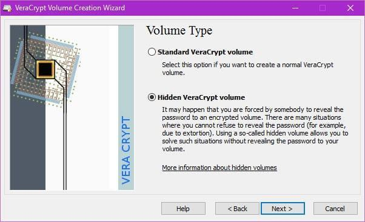

Als Beschuldigte*r in einem Prozess kannst du dich auf dein Aussageverweigerungsrecht berufen um das Passwort geheim zu halten. Als Zeug*in wird das schon schwieriger. Mit der Argumentation dass du dich dadurch selbst belasten würdest und daher ebenfalls ein Aussageverweigerungsrecht hast, verrätst du möglicherweise mehr als dir lieb ist. Ein ähnliches Problem hast du wenn irgendwer versucht dir das Passwort mit Gewalt oder Erpressung zu entlocken. Für solche Fälle wurde das Konzept der “Glaubhaften Abstreitbarkeit” oder “Plausible Deniability” entwickelt. Dein verschlüsselter Container oder dein verschlüsseltes System haben dabei zwei verschiedene Passwörter. Eines bringt dich in dein für schützenswerte Aktivitäten genutztes System, das andere in ein harmloses “Decoy-System” in dem keine sensiblen Daten gespeichert werden. Sollte nun irgendwer versuchen dich zur Herausgabe des Passworts zu zwingen kannst du einfach das Passwort für das Decoy-System nennen. Dein Gegenüber wird sich einloggen und das falsche System durchsuchen. Das noch mehr Daten existieren kann nicht erkannt werden.
Die Software VeraCrypt die wir hier bereits angesehen haben unterstützt diese Funktion. Dort heißt das ganze „Hidden Volume“.

Um diese Funktion zu nutzen beginnst du mit einem unverschlüsselten System, installierst VeraCrypt wie zuvor beschrieben und verwendest dann die Funktion „Create Hidden Operating System“. Die optimale Größe der verschiedenen Partitionen sollte das Programm für dich aussuchen. Dann wird ein sogenanntes „Outer Volume“ erstellt. Dieses kannst du als weitere Sicherheitsebene betrachten, Dein Decoy-System enthält nur harmlose Daten. Dein Outer-Volume enthält Daten die einen sensiblen Eindruck machen, die du aber preisgeben kannst falls du gezwunden werden sollst die versteckten Daten zu entschlüsseln. Der heiße Scheiß liegt stattdessen aber im Hidden-Volume, dessen Passwort du nie preisgibst. (Insgesamt gibt es also drei Passwörter.) VeraCrypt hat nun also das Outer-Volume erstellt und du befüllst es mit ein paar pseudo-sensiblen Daten. Das Programm wird dir sagen wie groß die Datenmenge sein darf, damit noch genug Platz für das Hidden-Volume ist in dem deine echten Geheimnisse aufbewahrt werden. Dieses wird im nächsten Schritt erstellt. Nun haben wir also ein Outer-Volume, ein Hidden-Volume und es fehlt nur noch das Decoy-System. Auf der Partition für das Decoy-System kannst du nun einfach eine neue Windows-Installation erstellen und diese mit der normalen Systemverschlüsselung von VeraCrypt verschlüsseln. Damit hast du dein Plausible-Deniability-System erfolgreich eingerichtet. 
Ja, das ist leider ziemlich kompliziert, kann dir aber in bestimmten Situationen von großem Nutzen sein. Weitere Informationen und Sicherheitshinweise findest auf der Seite von VeraCrypt. Eine Anleitung zu Plausible Deniability unter Linux findest du bei LinuxBrujo.
Tricks wie diese können unter Umständen helfen dich in Verhörsituationen zu entlasten, aber selbstverständlich sind sie keine Garantie dass dein Gegenüber dir glaubt und ggf. auf die Anwendung von Gewalt verzichtet.

Links: 
[Wikipedia - Gummischlauch-Kryptoanalyse](https://de.wikipedia.org/wiki/Rubber-hose_cryptanalysis) 
[VeraCrypt - Plausible Deniability](https://www.veracrypt.fr/en/Plausible%20Deniability.html) 
[VeraCrypt - Hidden Operating System](https://www.veracrypt.fr/en/VeraCrypt%20Hidden%20Operating%20System.html) 
[LinuxBrujo - Plausible Deniability with LUKS](https://blog.linuxbrujo.net/posts/plausible-deniability-with-luks/) 
