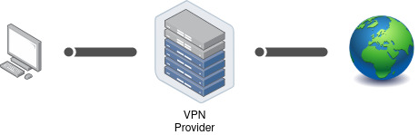

# Anonym im Netz

  

    Inhalt
  

* TOC
{:toc}

Ganz grundlegend: Solltest du nicht wollen, dass ersichtlich ist was Du im Internet machst, musst Du einen Anonymisierungsdienst verwenden. Das Tool, welches Dir hierfür die besten Chancen bietet ist der 'Tor Browser'. Es gibt noch andere Angebote die das selbe versprechen, diese sind aber entweder unsicherer (wie z.B. VPNs, mehr dazu weiter unten) oder weit weniger verbreitet (wie z.B. [I2P](https://geti2p.net/de/) oder [Freenet](https://freenetproject.org/)) damit auch weniger von Fachleuten geprüft.

## Tor

### Funktionsweise

Bei der Verwendung von Tor wird dein Datenverkehr verschlüsselt über 3 Rechner (genannt Tor-Relays) freiweilliger BetreiberInnen umgeleitet, bis er dann vom Letzten an die von Dir aufgerufene Seite weitergeleitet wird. Durch die Verwendung von diesen 3 Zwischenstationen ist sichergestellt, dass niemand genug Informationen hat um die weitergeleitet Informationen Dir zu zu ordnen. Denn:

 - Das erste Relay sieht nur, dass die Verbindung von dir kommt, aber nicht was über die Verbindung geht
 - Das mittlere Relay sieht nur verschlüsselte Daten vom ersten Relay und gibt sie an ein anderes Relay weiter
 - Das letzt Relay  ('Exit-Relay') entschlüsselt und leitet nur Daten an die Zieladreese weiter, dessen Absender es aber nicht kennt

Das stellt den endscheidenden Vorteil gegenüber einem VPN dar, mehr dazu im Abschnitt zu VPNs. 

 
Quelle: [Edward Snowden auf Twitter](https://twitter.com/Snowden/status/653587720598626304)

### Tor Browser

Die einfachste Methode um Tor zu benutzen ist der [Tor Browser](https://www.torproject.org/). Es gibt ihn so wohl für PCs, Android als auch für [iOS](https://apps.apple.com/de/app/onion-browser/id519296448). Dieser ist ein angepasster Firefox, der jedoch den kompletten Verkehr durch das Tor Netzwerk leitet. Zusätzlich speichert der Browser selbst keine Daten dauerhaft auf deinem System. Die Verwendung des Tor Browser kann deinen Anonymität natürlich nicht gewährleisten, wenn Du auf den angesurften Seiten persönliche Daten preisgibst oder dich in rückverfolgbare Konten einloggst.

Grundsätzlich solltest du bedenken, dass mögliche Überwacher Deines Anschlusses sehen können dass du Tor benutzt. Allerdings können sie nicht sehen was du machst, denn die Verbindung ins Netzwerk ist verschlüsselt. Die Nutzung von Tor an sich macht dich nicht verdächtig, denn außer dir machen das alleine [in Deutschland über 150.000 Meschen täglich](https://metrics.torproject.org/userstats-relay-country.html?country=de&events=off).

> ⚠ Wichtig ⚠ 
>
> - [Security Level](https://tb-manual.torproject.org/security-settings/) mindestens 'Safer' besser 'Safest'
>
> - Keine Addons installieren
>
> - Einstellungen des Browsers nicht ändern

### Betriebsysteme mit Tor-Integration

Um Deine Anonymität und IT-Sicherheit weiter ab zu sichern und Dich vor eigenen Fehlern zu bewaren gibt es zusätzlich spiezielle Betriebssysteme. Diese leiten wirklich allen Traffic über Tor und auf reden gar nicht auf andere Weise überhaupt mit dem Internet. 

#### Tails

[Tails](https://tails.boum.org/) kannst du dir herunterladen, mit dem mitgelieferten Installer auf einen USB-Stick übertragen und dann als sogennantes “Live-System” auf deinem Rechner starten. Dazu steckst du den Stick ein und startest deinen Computer neu. Wenn während dem Start eine Meldung wie “Press F12 for Boot Menu” oder so ähnlich auftaucht drücke die entsprechende Taste und wähle im folgenden Menü deinen USB-Stick aus. Nun wird anstelle deines normalen Betriebssystems Tails gestartet werden. Wenn du fertig bist kannst du den Rechner herunterfahren und den USB-Stick entfernen, dann ist alles wieder beim Alten. Das ganze hat einen Aspekt der gleichzeitig Vor- und Nachteil ist: In Tails kannst du üblicherweise keine Daten dauerhaft speichern. Nach dem Herunterfahren ist alles verschwunden.

Wenn du mehr zu Tails wissen willst lies die [offizielle Doku](https://tails.boum.org/doc/index.de.html) oder [Capulcu über Tails (PDF)](https://capulcu.blackblogs.org/wp-content/uploads/sites/54/2019/01/Tails2019-01-27-A4.pdf) dazu. Letzere legt einen sehr hohen Sicherheitsstandard vor, der wahrscheinlich für viele nicht immer praktikabel ist, enthält aber definitiv eine Menge wertvoller Tipps.

#### Whonix

[Whonix](https://www.whonix.org/) funktioniert etwas anders als Tails. Für Whonix installierst du dir die Software VirtualBox mit der du virtuelle Maschinen betreiben kannst. Das ist quasi ein simulierter Computer der auf deinem richtigen Computer läuft. Dann lädst du dir die Whonix Images herunter und importierst diese in VirtualBox. Ja richtig gehört, es sind zwei Images. Eins davon ist das Whonix-Gateway welches die Verbindung mit dem Internet aufbaut und dafür sorgt das alles nur über Tor geleitet wird. Das andere ist die Whonix-Workstation. Die benutzt du um deine Arbeit zu machen. Alles was innerhalb der Workstation passiert wird über Tor geleitet werden. Dort kannst du auch Dinge speichern, denke also daran das Host-System auf dem die beiden virtuellen Maschinen laufen komplett zu verschlüsseln. Du weißt ja jetzt wie das geht. 

Bedenke, dass du bei Whonix kein „amnesisches“ System hast, also auch Spuren hinterlässt. Nutze Whonix daher nur auf verschlüsselten Geräten. 

#### Qubes OS

Falls du schon etwas mehr technische Erfahrung hast und mit der Sicherheit mal so richtig auf die Kacke hauen willst, dann schau dir das Betriebsystem [Qubes OS](https://www.qubes-os.org/) an. Dieses arbeitet mit mehreren virtuellen Maschinen und bietet neben vielen anderen Sicherheits-Features auch eine Integration von Whonix an. Qubes OS läuft nicht auf jedem Rechner, daher lohnt vorab der Blick auf deren [Liste der unterstützen Hardware](https://www.qubes-os.org/hcl/).

## VPN

Ein VPN (Virtual Private Network) funktioniert technisch ähnlich wie Tor, hat aber einen entscheidenden Nachteil: Dein Internetverkehr wird nur an _eine_ einzige Zwischeninstanz verschlüsselt übermittelt, nämlich den VPN-Provider. Das bedeutet, Du darauf angewiesen bist, dass dieser Anbieter nicht speichert, wer seine Nutzenden sind und welche Seiten diese aufrufen. Da dies nicht gewährleistet werden kann, solltest Du [keine](https://gist.github.com/joepie91/5a9909939e6ce7d09e29) VPNs [nutzen](https://schub.wtf/blog/2019/04/08/very-precarious-narrative.html). Denn die Anbieter müssen auf gerichtliche Anordnung diese Daten heraus geben und [machen das auch](https://www.theregister.com/2011/09/26/hidemyass_lulzsec_controversy/).

