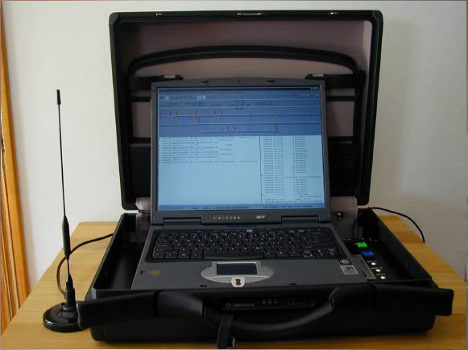

# IMSI Catcher und Stille SMS
Warum wird denn eigentlich immer dazu geraten zu Demos und Aktionen nur Zweithandys mitzunehmen?

Klar, die Cops können dir eventuell dein Haupthandy wegnehmen und Daten davon gewinnen. Doch es gibt noch andere Risiken, für die du das Handy nichtmal aus der Tasche genommen haben musst. Immer wieder kommt es vor das im Umfeld von Demos IMSI-Catcher aufgestellt werden. (Es ist möglich diese mit spezieller Software wie SnoopSnitch, Darshak oder AIMSICD zu erkennen.) IMSI-Catcher tun so als wären sie eine normale Basisstation im Handynetz und überreden Geräte in ihrem Umfeld dazu sich dort einzubuchen.
Damit können die Cops feststellen welche Handynummern gerade in der Umgebung sind und so die anwesenden Personen feststellen. Mit dem Gerät können auch Telefonate abgehört werden. Dazu leitet der IMSI-Catcher das Gespräch mit seiner eigenen Nummer weiter. Wird der Catcher nicht in diesem Abhörmodus betrieben sind für die Personen im Umfeld oft Anrufe komplett blockiert. Das gilt auch für Notrufe. Aus diesem Grund ist es so wichtig ein Demo-Handy mit einer anonymen SIM-Karte zu benutzen. Tust du das nicht kann deine Nummer mit dem IMSI-Catcher angezeigt werden und die Cops müssen nur noch kurz beim Handyprovider anrufen um deinen Namen und deine Adresse herauszufinden. Somit haben sie einen eindeutigen Beweis, dass du auf der Demo anwesend warst. Eine weitere Methode ist die Funkzellenabfrage, dabei sparen die Behörden sich die Arbeit mit dem IMSI-Catcher und gehen direkt zu den Betreibern der Funkzellen und lassen sich von denen eine Liste aller eingebuchten Nummern geben. Auch hier sind Fälle bekannt geworden bei denen das Verfahren auf Demos eingesetzt wurde. In Berlin gibt es mittlerweile ein “[Funkzellenabfragen-Transparenz-System](https://fts.berlin.de/)” mithilfe dessen du dich nach Abschluss der Ermittlungen benachrichtigen lassen kannst, falls du betroffen bist. In anderen Bundesländern gibt es das bisher noch nicht. Eine Ergänzung zur Funkzellenabfrage ist die sogenannte “Stille SMS”, diese wird benutzt wenn die Cops deine Nummer haben und wissen wollen wo du gerade bist. Dazu senden sie eine spezielle SMS an dein Gerät welche dir nicht angezeigt wird. Du merkst von der ganzen Sache also gar nichts, dabei antwortet dein Handy aber der Funkzelle in die du gerade eingebucht bist. Dadurch lässt sich sehr einfach dein Aufenthaltsort herausfinden. Das Bundesamt für Verfassungsschutz versendete im ersten Halbjahr 2018 ganze 103.224 stille SMS, das BKA 30.988 und die Bundespolizei 50.654. Die Landesbehörden für Verfassungsschutz und die Polizeien der Bundesländer nutzen das Verfahren ebenfalls reichlich. Es ist von deutlich mehr als einer Millionen Ortungen pro Jahr auszugehen. Stille SMS können mit der bereits erwähnten App SnoopSnitch sichtbar gemacht werden.

 
Bild: Ein IMSI-Catcher, Creative Commons BY-NC-SA 2.5 Canada. BC Civil Liberties Association

> ⚠ Fallstrick beim Demo-Handy ⚠ 
>
> Wenn du dir ein sauberes Handy und eine anonyme Nummer besorgt hast schalte das Gerät niemals bei dir Zuhause oder an Orten an denen du dich oft aufhältst an. Damit wäre die Nummer und das Handy nicht mehr anonym. Schalte es erst an wenn du am Ort der Aktion bist. Lege die SIM-Karte nie in dein normales Handy (und andersrum). Schalte Aktionshandy und normales Handy nie am gleichen Ort ein. 
> Überlege dir auch immer mal wieder die Nummer zu wechseln.

Links:

- [Wikipedia - IMSI-Catcher](https://de.wikipedia.org/wiki/IMSI-Catcher)
- [SnoopSnitch](https://opensource.srlabs.de/projects/snoopsnitch)
- [Darshak](https://github.com/darshakframework/darshak)
- [AIMSICD](https://cellularprivacy.github.io/Android-IMI-Catcher-Detector/)
- [Berliner Transparenzsystem](https://fts.berlin.de/)
- [Wikipedia - Stille SMS](https://de.wikipedia.org/wiki/Stille_SMS)
- [Statistik Stille SMS](https://netzpolitik.org/2018/halbjahreswerte-fuer-stille-sms-imsi-catcher-und-funkzellenabfragen/)
